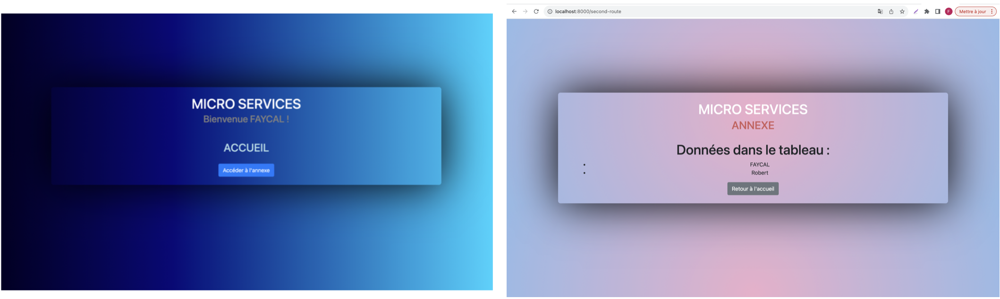

# Résumé
C'est une Application web Python qui utilise FastAPI et Jinja2 pour créer une interface utilisateur permettant de visualiser et d'ajouter des utilisateurs à une base de données PostgreSQL. L'application est conteneurisée à l'aide de Docker, et l'infrastructure est orchestrée à l'aide de Docker Compose pour simplifier le déploiement. Deux conteneurs Docker (PostgreSQL et Adminer) sont obtenus à partir du Docker Hub, tandis que le conteneur Webapp est configuré localement. Les choix techniques incluent FastAPI pour sa rapidité, Jinja2 pour le rendu des modèles, Docker pour la portabilité, PostgreSQL (relationnel) pour la persistance des données, et Docker Compose pour la gestion des conteneurs. Pour le déploiement, AWS ou Azure sont des choix judicieux en raison de leur robustesse, de leur scalabilité et de leurs services de conteneurs, comme AWS ECS ou Azure Kubernetes Service, pour une gestion simplifiée de l'infrastructure.

# Architecture

# More
Front (2 routes : Accueil, Annexe)

Backend avec BDD dans un conteneur spécifique :

PostgreSQL, une base de données relationnelle, offre une structure de données organisée et garantit la fiabilité grâce à la prise en charge des transactions ACID.

Table : Utilisateur

Image de la web App sur DockerHub :
https://hub.docker.com/repository/docker/harcus78/microservice/general

Build sans erreur : 

